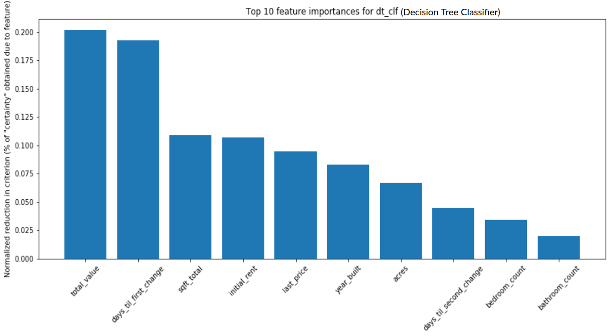
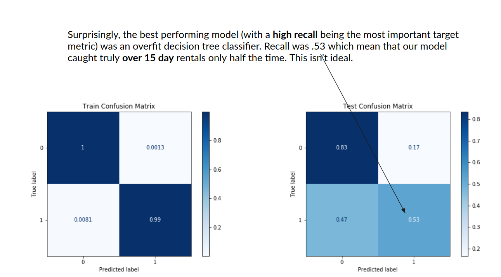

# Module 2 Final Project

## The Goal

The goal of this project is to create 2 machine learning models that can predict how long a rental will remain vacant on the market. These models can then inform rental management companies' marketing strategies, potentially telling them when to reduce the price, by how much and which of the properties in their portfolio will rent most quickly.

The data I used includes daily advertised rents and property specs that were scraped by my automated scrapers between 07-06-2018 and 12-09-2019 (~28 million rows representing daily rental information for ~1.3 million unique rental addresses). The final dataset I use will only include a sample of the larger set of approximately 18,000 unique rentals.

# My Approach
* Use PostgreSQL to extract data from database (Create temporary table that forms the basis of our dataset, uses window function over parcel_id to compare rental info over multiple days.)
* Use pandas to initially ingest the datasets and clean them, fill missing values, correct data types, convert certain columns to binary, remove outliers, bin and one-hot encode columns
* Create baseline Decision Tree classifier
* Create gridsearched decision tree classifier, XGboost classifier and Random Forest classifier. Compare results.

# After creating baseline model, investigate feature importances and confusion matrix

See which features contributed to classification the most:

Evaluate classifier performance with confusion matrix:

On the test data, the classifier did very well predicting when a rental did not take over 15 days to rent (True Negative Rate) but when the rental did, in fact, take over 15 days to rent it was only correct 56% of the time. That's the area where we can improve the model the most, that is, labeling it correctly when the rental took more than 15 days.

# Conclusion
The best performing model (the decision tree model) only achieved a recall of .53 which means that the classifier only caught rentals that would take over 15 days to rent about 50% of the time. More data will likely be needed properly distinguish between the two classifications.
